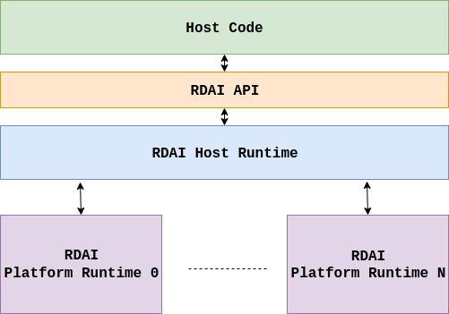

# RDAI (Reconfigurable Device Access Interface)
## What is RDAI?

**RDAI** is an API specification for accessing reconfigurable devices and hardware accelerators.

## RDAI Components

    </img>

RDAI-enabled environments require 3 components to properly function:
- `RDAI API`: a thin C-based API
- `RDAI Host Runtime`: the execution broker. A host runtime is responsible for dispatching host API calls to appropriate platform runtimes
- `RDAI Platform Runtime`: software layer that controls a specific hardware platform (e.g. FPGA, CGRA, etc) and accelerators implemented on it

## RDAI Execution Model
The execution model targeted by RDAI is *host-directed* execution with parallel accelerator devices.
A host program runs on a CPU and manages the execution of accelerated tasks on attached accelerator devices.
Accelerator devices are configured within a hardware platform. A hardware platform can be an FPGA, a CGRA, a virtual simulation platform, etc.

Each supported platform has to:
- provide an implementation of required APIs (a.k.a `RDAI_PlatformOps`)
- be registered with the host runtime before accelerator execution

Each platform is of a particular type and is allocated an ID during registration with the host runtime.

Each device is identified with a VLNV tag (Vendor-Library/Class-Name-Version) and an ID that is assigned by its containing platform.

## RDAI Memory Model
